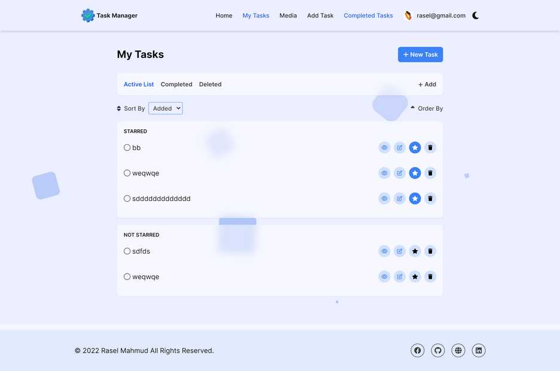
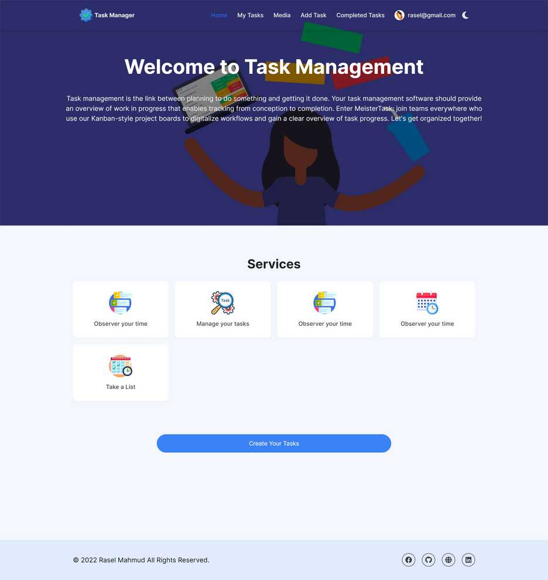
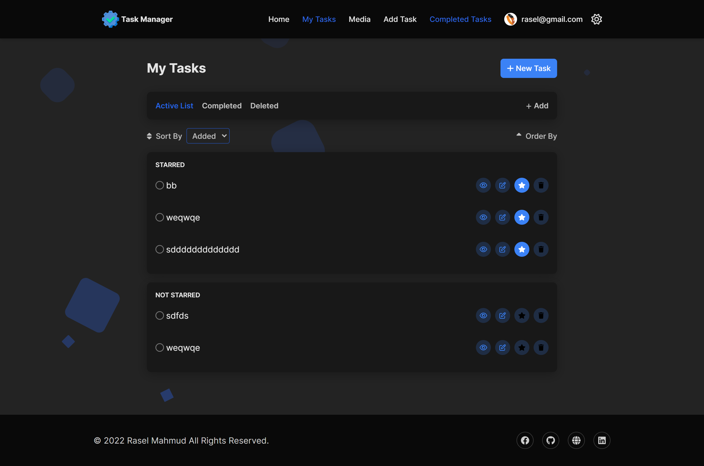

# Task Management (Client)
## A simple dynamic task management app

### Github Repo Client : https://github.com/rasel-mahmud-dev/task-manager-frontend
### Github Repo Backend: https://github.com/rasel-mahmud-dev/task-manager-backend

### Live site: http://task-manager3.web.app

### test user
Email: rasel@gmail.com \
password: 123456

## Application Features
- multiple user based task management
- user can create account by google or email password
- my tasks route show all current user tasks
- only logged user can check task detail
- media route show all media file that user uploaded
- also support dark / light theme

## Technology used.
- Typescript
- Reactjs
- react-router-dom
- Redux
- Tailwindcss
- Firebase
- fortawesome icons
- axios

## Preview of my tasks

## Preview of Hompage

## Preview Dark
